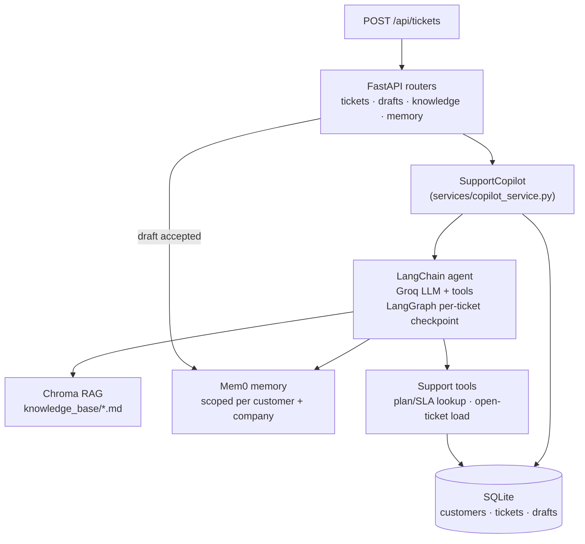

# AI Copilot for Support Agents

A FastAPI backend that drafts customer support replies for a human agent to
review, edit, and send — combining a tool-using LLM agent, a RAG knowledge
base, and long-term per-customer memory so replies get better the more a
customer is helped.

> Human-in-the-loop by design: the AI never sends anything. It proposes a
> draft; an agent accepts, edits, or discards it. Accepted drafts are the
> only thing written back into memory, so the system only learns from
> confirmed-good outcomes.

## What it does

1. **A ticket comes in** (`POST /api/tickets`) — a customer + ticket are
   persisted, and draft generation kicks off in the background so ticket
   creation stays fast.
2. **The copilot builds a draft**, using a LangChain agent (`create_agent`,
   backed by Groq) that has three sources of context available to it:
   - **Knowledge base search** — a Chroma vector store over markdown/text
     docs (billing FAQs, troubleshooting guides, etc.).
   - **Customer memory** — prior accepted resolutions for this customer,
     stored in Mem0, plus resolutions from anyone else at the same company
     (so one contact's fix helps their teammates too).
   - **Tools** — the agent can call structured lookups (plan tier / SLA,
     open-ticket load) mid-reasoning before it commits to a draft, the same
     way it would call a real billing or CRM API.
3. **An agent reviews the draft** in the UI, edits it if needed, and either
   accepts or discards it (`PATCH /api/drafts/{id}`). Accepting resolves the
   ticket and writes the exchange into memory for next time.
4. **Every draft carries its reasoning trail** — which memory hits, KB
   chunks, and tool calls fed into it — so a reviewer can see *why* the AI
   said what it said, not just the final text.

## Why this project

It's a compact demonstration of the pieces that show up in most production
LLM features: retrieval-augmented generation, tool calling, durable memory,
graceful degradation when a dependency (embeddings, memory) isn't
configured, and a human-approval loop instead of blind autosend — all
wired into a real, typed, tested-by-hand FastAPI service rather than a
notebook demo.

## Architecture



## Tech stack

| Layer | Choice |
|---|---|
| API | FastAPI + Pydantic v2 / `pydantic-settings` |
| Agent runtime | LangChain `create_agent` + LangGraph (`InMemorySaver` per-ticket threads) |
| LLM | Groq (`llama-3.1-8b-instant` by default) |
| Retrieval | ChromaDB (persistent), Gemini embeddings when configured, local default embeddings otherwise |
| Long-term memory | Mem0, Chroma-backed, scoped per customer **and** per company |
| Persistence | SQLite (customers / tickets / drafts, stdlib `sqlite3`) |
| Background work | FastAPI `BackgroundTasks` for async draft generation |

## Project layout

```
customer_support_agent/
├── api/
│   ├── app_factory.py        # FastAPI app, lifespan (init DB + dirs)
│   ├── dependencies.py       # DI wiring, cached copilot instance
│   └── routers/               # tickets, drafts, knowledge, memory, health
├── core/settings.py           # env-driven config (pydantic-settings)
├── integrations/
│   ├── rag/chroma_kb.py       # chunk + embed + search knowledge_base/*.md
│   ├── memory/mem0_store.py   # Mem0 wrapper, scoped by user_id
│   └── tools/support_tools.py # @tool-decorated LangChain tools
├── repositories/sqlite/       # customers / tickets / drafts repos
├── schemas/api.py             # request/response Pydantic models
└── services/
    ├── copilot_service.py     # agent assembly + draft generation
    ├── draft_service.py       # serialization + storage orchestration
    └── knowledge_service.py   # KB ingestion entry point
notebooks/experiments.ipynb    # scratch pad for prompt/tool iteration
```

## Getting started

**Requirements:** Python 3.11+, a [Groq API key](https://console.groq.com/keys)
(free tier is fine), optionally a Google AI Studio key for Gemini embeddings.

```bash
# install
uv sync                     # or: pip install -e .

# configure
cp .env.example .env
# fill in GROQ_API_KEY (required) and GOOGLE_API_KEY (recommended, for embeddings)

# run
python main.py              # http://localhost:8000, docs at /docs
```

Add a few `.md`/`.txt` files to `knowledge_base/`, then:

```bash
curl -X POST http://localhost:8000/api/knowledge/ingest -d '{"clear_existing": false}' \
  -H "Content-Type: application/json"
```

### Try it end to end

```bash
# create a ticket — a draft generates in the background
curl -X POST http://localhost:8000/api/tickets -H "Content-Type: application/json" -d '{
  "customer_email": "alex@acme.com",
  "customer_name": "Alex",
  "customer_company": "Acme",
  "subject": "Cannot log in via SSO",
  "description": "SSO login has been failing since this morning with a SAML error.",
  "priority": "high"
}'

# fetch the generated draft (ticket_id from the response above)
curl http://localhost:8000/api/drafts/1

# accept it — resolves the ticket and saves the resolution to memory
curl -X PATCH http://localhost:8000/api/drafts/1 -H "Content-Type: application/json" \
  -d '{"status": "accepted"}'

# see what the copilot remembers about this customer
curl http://localhost:8000/api/customers/1/memories
```

## API surface

| Method & path | Purpose |
|---|---|
| `POST /api/tickets` | Create a ticket (and customer, if new); optionally auto-generate a draft |
| `GET /api/tickets` / `GET /api/tickets/{id}` | List / fetch tickets |
| `POST /api/tickets/{id}/generate-draft` | Force (re)generate a draft synchronously |
| `GET /api/drafts/{ticket_id}` | Latest draft for a ticket, with full reasoning context |
| `PATCH /api/drafts/{id}` | Edit content or set status (`accepted` writes to memory + resolves the ticket) |
| `POST /api/knowledge/ingest` | (Re)index `knowledge_base/*.md,*.txt` into Chroma |
| `GET /api/customers/{id}/memories` | List everything remembered about a customer |
| `GET /api/customers/{id}/memory-search?query=` | Semantic search over a customer's memory |
| `GET /health` | Liveness check |

Full interactive schema at `/docs` once the server is running.

## Design notes

- **Degrades gracefully, never crashes on missing config.** Mem0 requires an
  embedding provider (Gemini/OpenAI/local); if none is set, memory is
  disabled and draft generation still proceeds — the gap is surfaced in
  `context_used.errors` instead of a 500.
- **The agent's final answer is never guaranteed non-empty** with
  tool-calling models on Groq, so `SupportCopilot` falls back to a
  no-tools LLM call, and finally to a deterministic templated reply, so the
  endpoint always returns something reviewable.
- **Memory is scoped two ways** — by customer email and by a normalized
  `company::<slug>` id — so a fix that worked for one teammate surfaces for
  another at the same company, without leaking across companies.
- **Every draft is auditable.** `context_used` records hit counts,
  trimmed highlights, and the full tool-call trace (arguments, status,
  output) alongside the draft text.

## Possible next steps

- Swap `support_tools.py`'s stubbed billing/ticket-load lookups for real
  CRM/billing API calls.
- Add auth and a proper agent-facing UI on top of the existing API.
- Add automated tests around draft generation's fallback paths.
